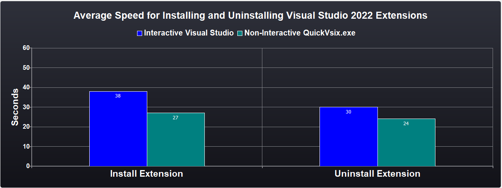
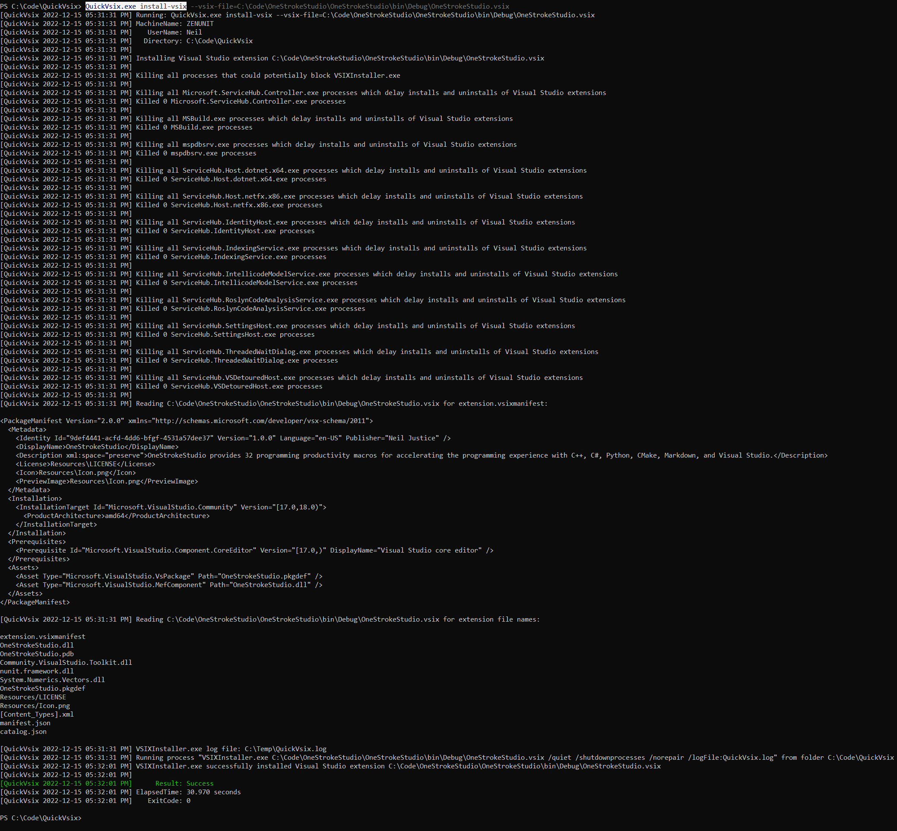
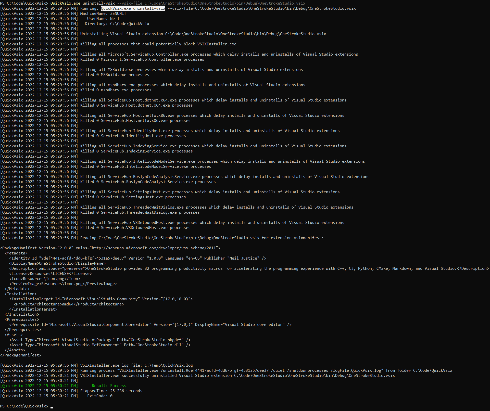
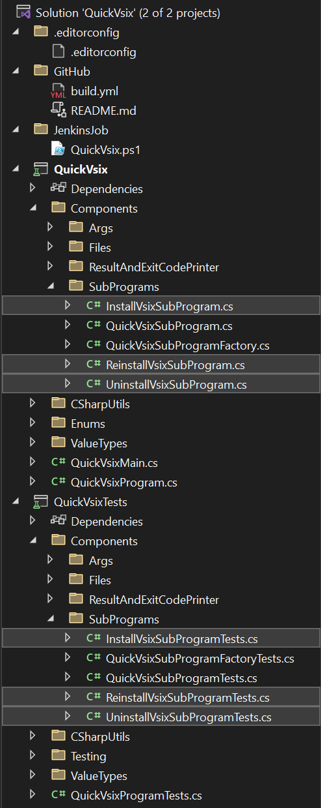
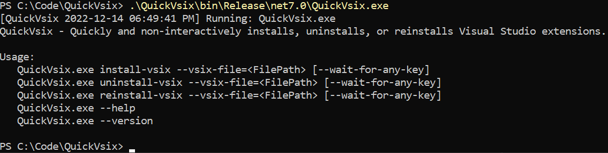
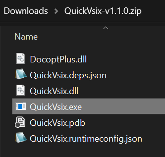

<p align="center"> 
<br>
<a href="https://github.com/NeilJustice/QuickVsix/actions/workflows/build.yml"></a>
<a href="https://codecov.io/gh/NeilJustice/QuickVsix"></a>
</p>

QuickVsix is a C# command line program for quickly and non-interactively installing and uninstalling Visual Studio extensions.

The default workflow for installing and uninstalling Visual Studio extensions is by way of a sequence of mouse clicks on interactive install and uninstall dialogs, which costs time and focus relative to the non-interactive command line user experience provided by QuickVsix.exe.

QuickVsix works by running VSIXInstaller.exe and then waiting for VSIXInstaller.exe to complete its extension install, uninstall, or reinstall work.

### QuickVsix unlocks time savings for Visual Studio extension developers



### QuickVsix.exe command line usage

```
QuickVsix - Quickly and non-interactively installs, uninstalls, or reinstalls Visual Studio extensions.

Usage:
   QuickVsix.exe install-vsix --vsix-file=<FilePath> [--wait-for-any-key]
   QuickVsix.exe uninstall-vsix --vsix-file=<FilePath> [--wait-for-any-key]
   QuickVsix.exe reinstall-vsix --vsix-file=<FilePath> [--wait-for-any-key]
   QuickVsix.exe --help
   QuickVsix.exe --version
```

### Console output for `QuickVsix.exe install-vsix`

`QuickVsix.exe install-vsix --vsix-file=C:\Code\OneStrokeStudio\OneStrokeStudio\bin\Debug\OneStrokeStudio.vsix`



### Console output for `QuickVsix.exe uninstall-vsix`

`QuickVsix.exe uninstall-vsix --vsix-file=C:\Code\OneStrokeStudio\OneStrokeStudio\bin\Debug\OneStrokeStudio.vsix`



Console output for `QuickVsix.exe reinstall-vsix` is the console output for `QuickVsix.exe uninstall-vsix` followed by the console output for `QuickVsix.exe install-vsix`.

### Code structure as it appears in Visual Studio 2022



### Steps for building QuickVsix.exe from source

```powershell
git clone https://github.com/NeilJustice/QuickVsix
cd QuickVsix
dotnet build --configuration Release
```

Resulting executable QuickVsix.exe:



Contents of release `QuickVsix-v1.1.0.zip`:



### Thanks to

<a href="https://brandmark.io">brandmark.io</a> for QuickVsix's logo
