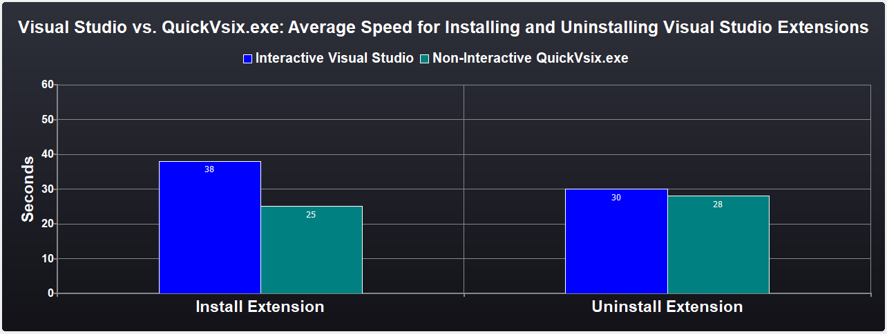
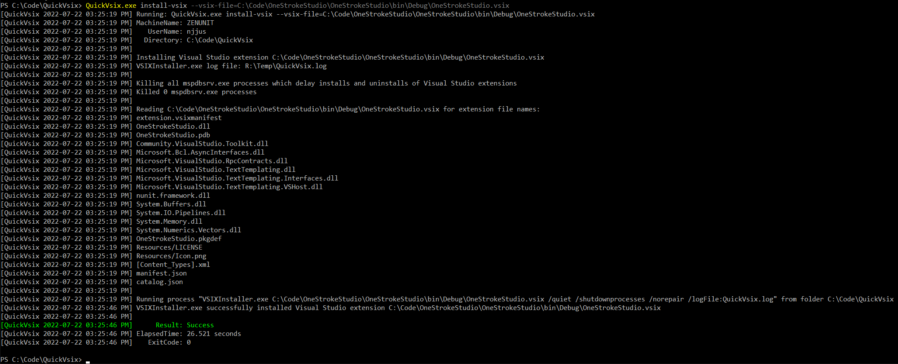
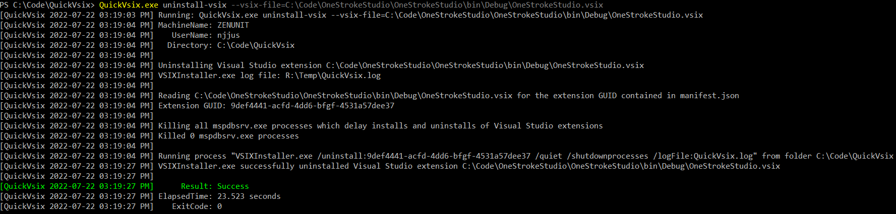
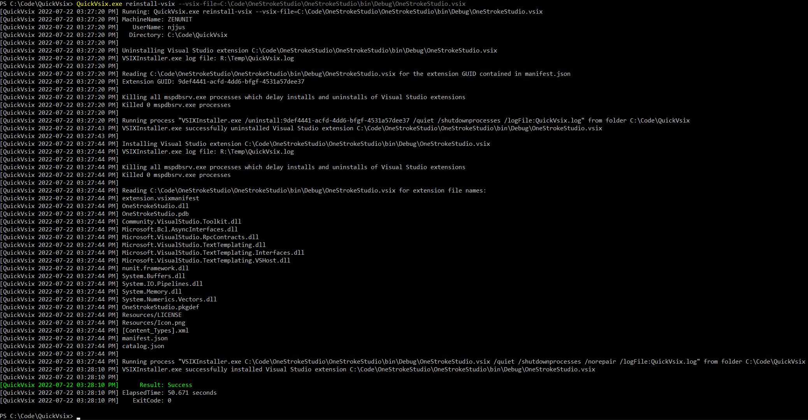
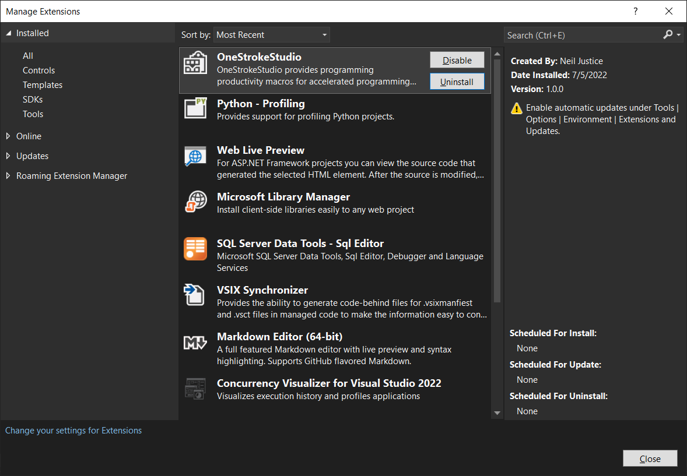
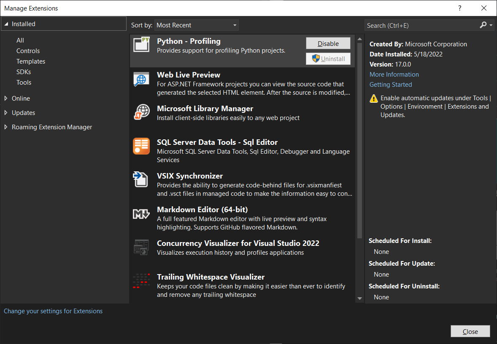
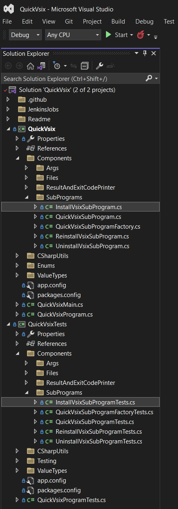
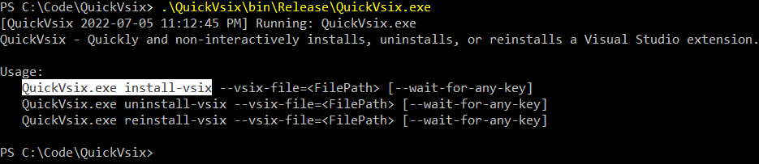

# QuickVsix

QuickVsix is a C# Windows command line program for quickly and non-interactively installing and uninstalling Visual Studio extensions.

|Build Type|Build Status|
|----------|------------|
|GitHub Actions Release build - windows-latest Visual Studio 2022|[](https://github.com/NeilJustice/QuickVsix/actions/workflows/build.yml)|
|Codecov.io C# code coverage|[](https://codecov.io/gh/NeilJustice/QuickVsix)|

The default workflow for installing and uninstalling Visual Studio extensions is by way of a sequence of mouse clicks on interactive installation and uninstallation dialogs, which costs time relative to the non-interactive command line experience provided by QuickVsix.exe.

QuickVsix works by running VSIXInstaller.exe (which must be added to the PATH before running QuickVsix.exe) and then waiting for the VSIXInstaller.exe process to complete its extension installation or uninstallation work.

#### QuickVsix.exe saves you time if you frequently reinstall Visual Studio extensions:



#### Command line usage

```
QuickVsix - Quickly and non-interactively installs, uninstalls, or reinstalls a Visual Studio extension.

Usage:
   QuickVsix.exe install-vsix --vsix-file=<FilePath> [--wait-for-any-key]
   QuickVsix.exe uninstall-vsix --vsix-file=<FilePath> [--wait-for-any-key]
   QuickVsix.exe reinstall-vsix --vsix-file=<FilePath> [--wait-for-any-key]
   QuickVsix.exe --version
```

#### QuickVsix.exe console output for `install-vsix`:



#### QuickVsix.exe console output for `uninstall-vsix`:



#### QuickVsix.exe console output for `reinstall-vsix`:



#### Before: Example extension [OneStrokeStudio](https://github.com/NeilJustice/OneStrokeStudio) installed in Visual Studio 2022:



#### After Round 1: Example extension OneStrokeStudio uninstalled after having run `QuickVsix.exe uninstall-vsix`:



#### After Round 2: Example extension OneStrokeStudio installed again after having run `QuickVsix.exe install-vsix`:


#### QuickVsix code structure as it appears in Visual Studio 2022



#### How to build QuickVsix.exe from source with NuGet and MSBuild

```powershell
git clone https://github.com/NeilJustice/QuickVsix
cd QuickVsix
nuget.exe restore
MSBuild.exe /p:Configuration=Release
.\QuickVsix\bin\Release\QuickVsix.exe
```

Resulting QuickVsix.exe:

